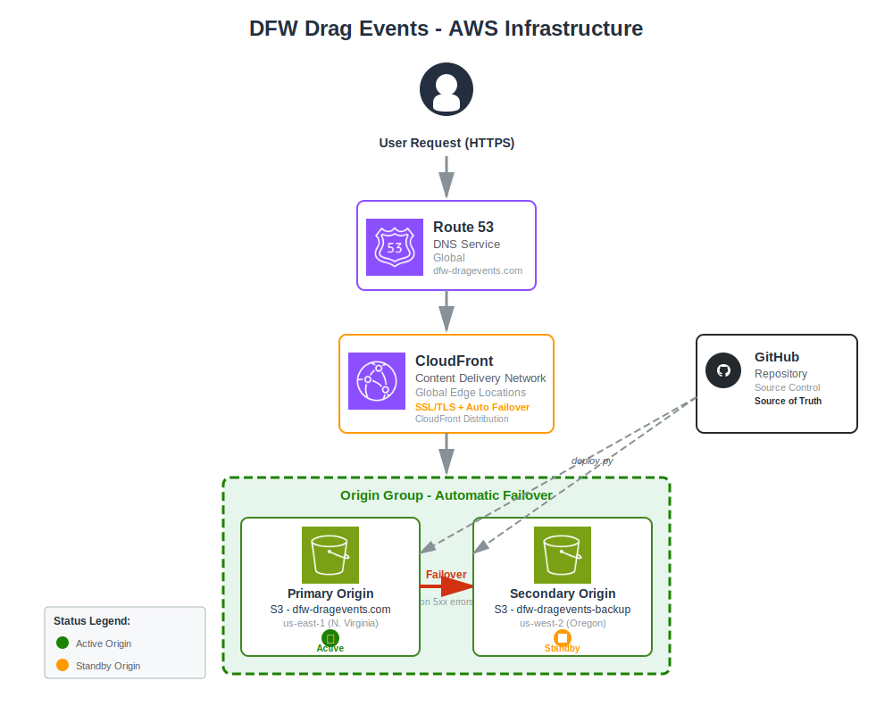

# High Availability & Disaster Recovery

## Overview

This document outlines the high availability strategy for dfw-dragevents.com to handle AWS regional outages.

## Infrastructure Architecture

### Visual Diagram (Official AWS Icons)



*Architecture diagram using official AWS Architecture Icons showing multi-region failover setup*

### Architecture Details

```
┌─────────────────────────────────────────────────────────────────┐
│                         User Request                            │
│                         (HTTPS/HTTP)                            │
└────────────────────────────┬────────────────────────────────────┘
                             │
                             ▼
┌─────────────────────────────────────────────────────────────────┐
│                    Amazon Route 53                              │
│                    DNS Service (Global)                         │
│                    dfw-dragevents.com                           │
└────────────────────────────┬────────────────────────────────────┘
                             │
                             ▼
┌─────────────────────────────────────────────────────────────────┐
│                    Amazon CloudFront                            │
│                    CDN (Global Edge Locations)                  │
│                    Distribution: EW03K014K18UC                  │
│                    SSL/TLS: ACM Certificate                     │
└────────────────────────────┬────────────────────────────────────┘
                             │
                             ▼
┌─────────────────────────────────────────────────────────────────┐
│              CloudFront Origin Group (Failover)                 │
│  ┌──────────────────────────┐    ┌──────────────────────────┐  │
│  │   PRIMARY ORIGIN         │    │   SECONDARY ORIGIN       │  │
│  │   Amazon S3              │───▶│   Amazon S3              │  │
│  │   dfw-dragevents.com     │    │   dfw-dragevents-backup  │  │
│  │   us-east-1 (N.Virginia) │    │   us-west-2 (Oregon)     │  │
│  │   Status: ✓ Active       │    │   Status: ⏸ Standby      │  │
│  │   Website Hosting        │    │   Website Hosting        │  │
│  └──────────────────────────┘    └──────────────────────────┘  │
│                                                                  │
│  Failover Criteria: 5xx errors, timeouts (30-60 seconds)       │
└─────────────────────────────────────────────────────────────────┘
                             ▲
                             │
                    ┌────────┴────────┐
                    │   GitHub Repo   │
                    │   (deploy.ps1)  │
                    │  Source Control │
                    └─────────────────┘

Features:
  ✓ 99.9% Uptime SLA
  ✓ Global CDN with Edge Caching
  ✓ Auto-Renewing SSL/TLS Certificates
  ✓ Multi-Region Redundancy (us-east-1 + us-west-2)
  ✓ Automatic Origin Failover
  ✓ Open Source (GitHub)
```

### How It Works

1. **User Request** → DNS resolution via Route 53
2. **Route 53** → Resolves to CloudFront distribution
3. **CloudFront** → Serves cached content from nearest edge location
4. **Origin Group** → Fetches from primary S3 (us-east-1)
5. **Automatic Failover** → If primary fails, switches to secondary S3 (us-west-2)
6. **Recovery** → Automatically returns to primary when available

### How It Works

1. **Normal Operation:** CloudFront serves from us-east-1
2. **Primary Failure:** CloudFront detects 5xx errors or timeouts
3. **Automatic Failover:** CloudFront switches to us-west-2
4. **Recovery:** CloudFront switches back when us-east-1 recovers

### Benefits

- ✅ **Automatic:** No manual intervention needed
- ✅ **Fast:** Failover in seconds
- ✅ **Transparent:** Users don't notice
- ✅ **Cost-Effective:** ~$0.02/month for small site
- ✅ **No DNS Changes:** CloudFront handles everything
- ✅ **Global CDN:** CloudFront remains available

## Setup Instructions

### 1. Create Secondary Bucket and Sync Content

```powershell
cd tools\aws
.\setup-cloudfront-failover.ps1
```

This will:
- Create secondary bucket in us-west-2
- Enable website hosting
- Apply public read policy
- Sync current content

### 2. Configure CloudFront Origin Failover

**Via AWS Console (Recommended):**

1. Go to [CloudFront Console](https://console.aws.amazon.com/cloudfront/v3/home)
2. Click your distribution
3. Go to **Origins** tab
4. Click **Create origin**
5. Add secondary origin:
   - **Origin domain:** `dfw-dragevents-backup.s3-website-us-west-2.amazonaws.com`
   - **Protocol:** HTTP only
   - **Name:** `S3-dfw-dragevents-backup`
6. Click **Create origin group**
7. Configure:
   - **Name:** `S3-Failover-Group`
   - **Origins:** Add both primary and secondary
   - **Failover criteria:** 500, 502, 503, 504, 404, 403
8. Go to **Behaviors** tab
9. Edit **Default** behavior
10. Change **Origin** to use the origin group
11. Save changes

**Via AWS CLI:**

```powershell
# Get current config
aws cloudfront get-distribution-config --id EW03K014K18UC > dist-config.json

# Edit dist-config.json to add:
# 1. Secondary origin
# 2. Origin group with failover
# 3. Update default behavior to use origin group

# Update distribution (replace <ETag> with value from get-distribution-config)
aws cloudfront update-distribution --id EW03K014K18UC --distribution-config file://dist-config.json --if-match <ETag>
```

### 3. Update Deploy Script

Modify `deploy.ps1` to sync to both buckets:

```powershell
# Add after primary sync
Write-Host "`n--- Syncing to secondary bucket ---" -ForegroundColor Cyan
aws s3 sync $SiteDir "s3://dfw-dragevents-backup/" --delete --region us-west-2
Write-Host "[OK] Secondary bucket synced" -ForegroundColor Green
```

## Testing Failover

### Test Secondary Bucket

```powershell
# Verify secondary bucket works
Start-Process "http://dfw-dragevents-backup.s3-website-us-west-2.amazonaws.com"
```

### Simulate Primary Failure

1. **Temporarily disable primary bucket:**
   ```powershell
   aws s3api put-bucket-website --bucket dfw-dragevents.com --website-configuration '{}' --region us-east-1
   ```

2. **Test site:** Visit https://dfw-dragevents.com
   - Should automatically failover to us-west-2
   - May take 30-60 seconds for CloudFront to detect failure

3. **Re-enable primary:**
   ```powershell
   aws s3 website s3://dfw-dragevents.com/ --index-document index.html --error-document 404.html --region us-east-1
   ```

## Monitoring

### CloudWatch Alarms

Set up alarms for origin failures:

```powershell
aws cloudwatch put-metric-alarm `
  --alarm-name "CloudFront-Origin-Errors" `
  --alarm-description "Alert on CloudFront 5xx errors" `
  --metric-name 5xxErrorRate `
  --namespace AWS/CloudFront `
  --statistic Average `
  --period 300 `
  --threshold 5 `
  --comparison-operator GreaterThanThreshold `
  --evaluation-periods 2
```

### Check Origin Health

```powershell
# View CloudFront metrics
aws cloudwatch get-metric-statistics `
  --namespace AWS/CloudFront `
  --metric-name Requests `
  --dimensions Name=DistributionId,Value=EW03K014K18UC `
  --start-time 2024-01-01T00:00:00Z `
  --end-time 2024-01-02T00:00:00Z `
  --period 3600 `
  --statistics Sum
```

## Cost Analysis

### Monthly Cost (for ~100MB site)

| Component | Cost |
|-----------|------|
| Primary S3 (us-east-1) | $0.002 |
| Secondary S3 (us-west-2) | $0.002 |
| CloudFront (no change) | $0.00 (free tier) |
| Data transfer (sync) | $0.00 (minimal) |
| **Total** | **~$0.004/month** |

**Additional cost:** Essentially free for small static sites

## Alternative Solutions

### Option 1: CloudFront Origin Failover (Recommended) ⭐
- **Pros:** Automatic, fast, cheap
- **Cons:** Requires manual CloudFront config
- **Cost:** ~$0.004/month
- **Recovery Time:** Seconds

### Option 2: Multi-Region Active-Active
- **Pros:** Best performance globally
- **Cons:** Complex, expensive
- **Cost:** ~$10+/month
- **Recovery Time:** Instant

### Option 3: Manual Failover
- **Pros:** No extra cost
- **Cons:** Requires manual intervention
- **Cost:** $0
- **Recovery Time:** 5-10 minutes

### Option 4: Different Provider (Netlify, Vercel, etc.)
- **Pros:** Built-in global CDN and redundancy
- **Cons:** Vendor lock-in, migration effort
- **Cost:** Free tier available
- **Recovery Time:** N/A (always available)

## Recommendation

**For dfw-dragevents.com:**

✅ **Implement CloudFront Origin Failover**

**Reasoning:**
1. Minimal cost (~$0.004/month)
2. Automatic failover (no manual intervention)
3. Fast recovery (seconds)
4. Simple to maintain
5. Protects against regional outages
6. No code changes needed

**When NOT to use:**
- If cost is absolutely critical (use manual failover)
- If you need active-active multi-region (use different solution)
- If you want zero AWS dependency (use different provider)

## Implementation Checklist

- [ ] Run `setup-cloudfront-failover.ps1`
- [ ] Test secondary bucket URL works
- [ ] Configure CloudFront origin group (manual step)
- [ ] Update deploy script to sync both buckets
- [ ] Test failover by disabling primary
- [ ] Set up CloudWatch alarms
- [ ] Document failover in runbook
- [ ] Test recovery process

## Disaster Recovery Runbook

### If us-east-1 Goes Down

**Automatic (with failover configured):**
1. CloudFront detects failure (30-60 seconds)
2. CloudFront switches to us-west-2 automatically
3. Site remains available
4. Monitor CloudWatch for alerts

**Manual (without failover):**
1. Update CloudFront origin to point to us-west-2:
   ```powershell
   # Update CloudFront distribution origin
   aws cloudfront update-distribution --id EW03K014K18UC ...
   ```
2. Wait for CloudFront to propagate (5-10 minutes)
3. Site restored

### If Both Regions Go Down

1. Deploy to different provider (Netlify, Vercel, GitHub Pages)
2. Update DNS in Route 53
3. Recovery time: 10-15 minutes

## Additional Resources

- [CloudFront Origin Failover](https://docs.aws.amazon.com/AmazonCloudFront/latest/DeveloperGuide/high_availability_origin_failover.html)
- [S3 Cross-Region Replication](https://docs.aws.amazon.com/AmazonS3/latest/userguide/replication.html)
- [CloudFront Monitoring](https://docs.aws.amazon.com/AmazonCloudFront/latest/DeveloperGuide/monitoring-using-cloudwatch.html)
